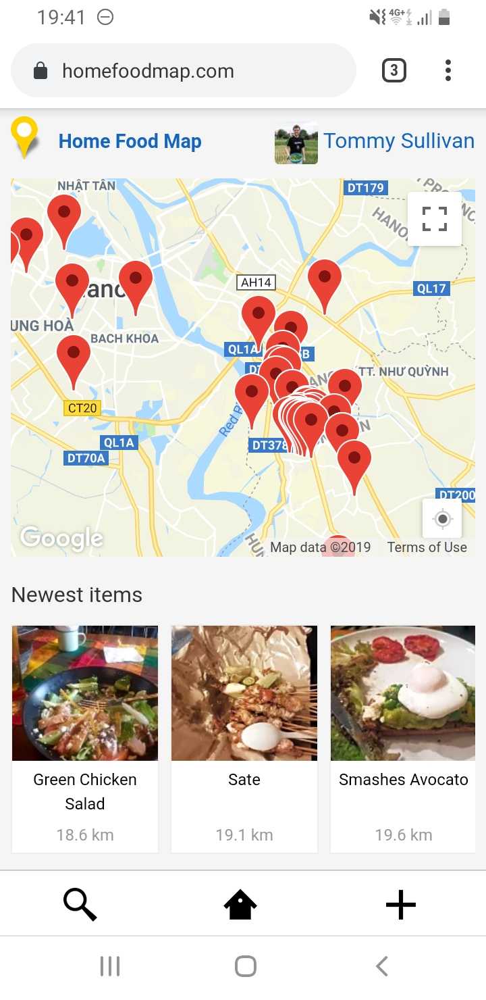

# [LocationMachine.io](https://www.locationmachine.io)

Welcome!  Location Machine is an attempt to connect: GPS points, quality photos, 3rd party messaging apps.

Right now it kinda looks like this:



Background: there are many uses for a generic app of this nature: event organization, photo blogging, geocaching...

Hopefully, Location Machine can provide a toolkit of services necessary to setup other apps, supporting UI customization, and maintain an upgradable core.
Much like [WordPress.org](https://wordpress.org/) provides a CMS for websites, blogs, and other types of apps.

How will that core / UI layer be segregated?  Likely at the JS level, but it will evolve as we spin up instances of Location Machine.


## Getting Started

These instructions will help you get a copy of the project up and running on your local machine for development and testing purposes.

See [deployment](#deployment) for notes on how to deploy Location Machine to Heroku or Google App Engine.


### Prerequisites

Right now, I am using the following tools to build and run the project:

- Ubuntu 18.04
- Git 2.17.1
- PostgreSQL 9.6.11
- Ruby 2.5.1
- Bundler 1.16.2
- Yarn 1.12.3

You can likely run the project with other versions of that software, it just hasn't been tested yet.
OS X will be supported at somepoint in the future.  Windows, fuhgeddaboudit!


### Installing

Checkout and install dependencies:
```
git clone git@github.com:sillylogger/location-machine.git
cd location-machine
bundle install
yarn install
```

### Credentials

Rails 5.2 provides [a great way](https://edgeguides.rubyonrails.org/security.html#environmental-security) to manage those credentials, but it isn't designed to support several installs of the same app.

To work past this, we have a `Credential` class that provides `fetch(namespace, key)` as an interface for `Rails.application.credentials` but allows keys to be overwritten with `ENV` variables.

If you have the minimum `config/credentials.yml.enc` credentials file like:
```
secret_key_base:

cloudinary:
  cloud_name: demo
```

Then:
```
ENV['CLOUDINARY_CLOUD_NAME'] = 'test'
puts Credential.fetch(:cloudinary, :cloud_name)
=> test

ENV.delete 'CLOUDINARY_CLOUD_NAME'
puts Credential.fetch(:cloudinary, :cloud_name)
=> demo
```

In order to run the app without everything 500'ing, you will need at least a secret_key_base and that cloudinary cloud_name.

Copy this structure into `rails credentials:edit` to create your own encrypted config **or** define environment variables like `CLOUDINARY_CLOUD_NAME`.

A complete list of all possible credentials can be found at `config/credentials.yml.example`

You'll want to provide a valid Google `maps_api_key` to stop Maps from showing "For development purposes only".

Additional credentials / services are explained in [3rd Party Services](#3rd-party-services)


### Running the app

Create the database and some sample data:

```
rails db:create
rails db:migrate
rails db:seed
```

You can then start the project with:
```
rails s
```

If everything worked all right, you should be able to visit the app at `http://localhost:3000` and login with the seed data: `admin@example.com` / `password`

**Yayyyy!**  As admin you can also modify settings at `http://localhost:3000/admin`

In order to login via Facebook's OAuth, you are going to need to use SSL locally.
The best way to do this is use [`mkcert`](https://github.com/FiloSottile/mkcert) to write trusted self-signed certs to `config/localhost.key` and `config/localhost.crt` with:

```
$(go env GOPATH)/bin/mkcert -cert-file config/localhost.crt -key-file config/localhost.key localhost 127.0.0.1 ::1
```

Then you can start `puma` with:

```
puma -b 'ssl://127.0.0.1:3000?key=config/localhost.key&cert=config/localhost.crt'
```

Make sure your Facebook App's Client OAuth Settings specify Valid OAuth Redirect URIs like `https://localhost:3000/users/auth/facebook/callback`


### Running the tests

Setup your test database with:

```
rails db:test:prepare
```

Then you should be able to run:

```
rspec spec
```


### Settings

These are settings that are store in the database and make it easy to customize Location Machine to your needs, much like [WordPress's Options](https://codex.wordpress.org/Option_Reference)

| Name          | Default Value                          | Purpose                                                        |
|---------------|----------------------------------------|----------------------------------------------------------------|
| site.title    | Location Machine                       | A human readable title in the navigation etc                   |
| site.tagline  | GPS meets Photography meets Messaging  | A human/computer readable tagline used in meta description     |
| site.host     |                                        | The full hostname to correct to; eg: www.locationmachine.io    |
| map.center    |                                        | The map's default center, used when location access is blocked |

**TODO:**

| Name              | Default Value    | Purpose                                                        |
|-------------------|------------------|----------------------------------------------------------------|
| site.public       |                  | A boolean that requires a user login to view                   |
| site.currency     |                  | To then allow proper formatting of price with [Globalize](https://github.com/globalizejs/globalize/blob/master/doc/api/currency/currency-formatter.md) |
| user.registration |                  | A boolean as to whether users can register or it is turned off |
| user.role         |                  | The default role for new users who register; see `User::ROLES` |


## Deployment

**TODO:** add a 0-to-Heroku deployment here


## Backlog

The product and development roadmap is maintained in [PivotalTracker](https://www.pivotaltracker.com/n/projects/2230844)


## 3rd Party Services

Don't build what you can buy.  As such, we rely on 3rd party services for:

| Service          | Currently Supported                                                                                  | Monthly Cost                | Development Roadmap                 |
|------------------|------------------------------------------------------------------------------------------------------|-----------------------------|-------------------------------------|
| Hosting          | [Google App Engine](https://cloud.google.com/appengine/)                                             | ~ $60                       | - [Heroku](https://www.heroku.com/) |
| Maps             | [Google Maps](https://developers.google.com/maps/documentation/javascript/tutorial)                  | free, for current usage     | |
| Analytics        | [Google Analytics](https://developers.google.com/analytics/devguides/collection/gtagjs/)             | free, for current usage     | |
| Auth             | [OAuth w/ facebook](https://developers.facebook.com/docs/facebook-login/manually-build-a-login-flow) | free                        | - Phone Number w/ [Authy](https://www.twilio.com/authy) <br/> - [OAuth w/ Google](https://developers.google.com/identity/protocols/OAuth2) |
| Image Processing | [Cloudinary](https://cloudinary.com/)                                                                | free, soon $89              | - [Thumbor](http://thumbor.org/)    |

These services require additional credentials.

To host image uploads, Rails [ActiveStorage](https://edgeguides.rubyonrails.org/active_storage_overview.html) can be configured to use S3, GCS, etc.  Currently the app supports `GCS` with credentials:
```
google:
  storage_service_account:
```

If deploying to Google App Engine, the [Postgres Cloud SQL](https://cloud.google.com/sql/docs/postgres/) will need credentials:
```
google:
  cloud_sql_username:
  cloud_sql_password:
  cloud_sql_connection_name:
```


<!-- ## License -->
<!--  -->
<!-- This project is licensed under the MIT License - see the [LICENSE.md](LICENSE.md) file for details -->


## Acknowledgments

* Hat tip to: [README Template](https://gist.github.com/PurpleBooth/109311bb0361f32d87a2)
* Inspiration: [WordPress.org](https://wordpress.org) :-)


